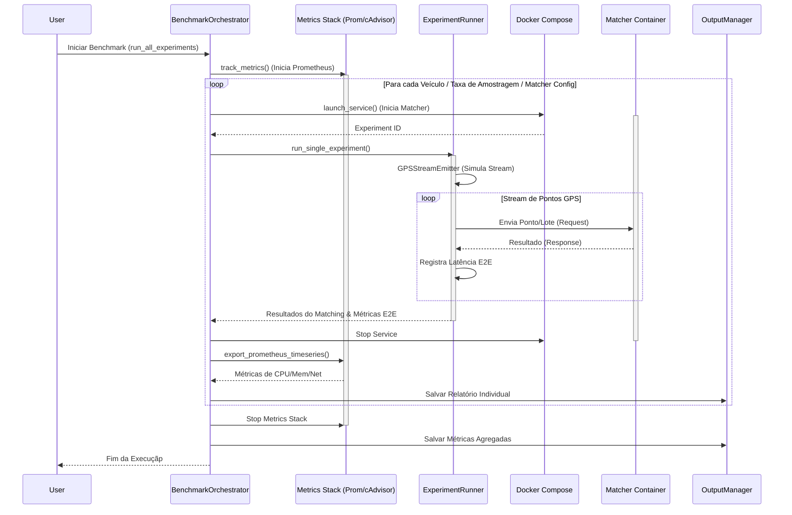
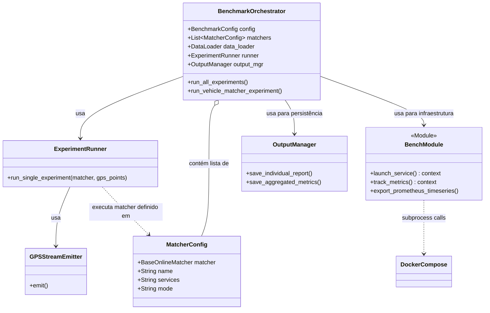
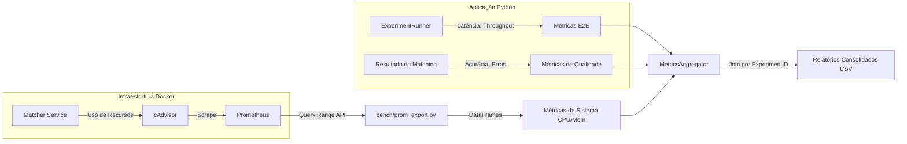
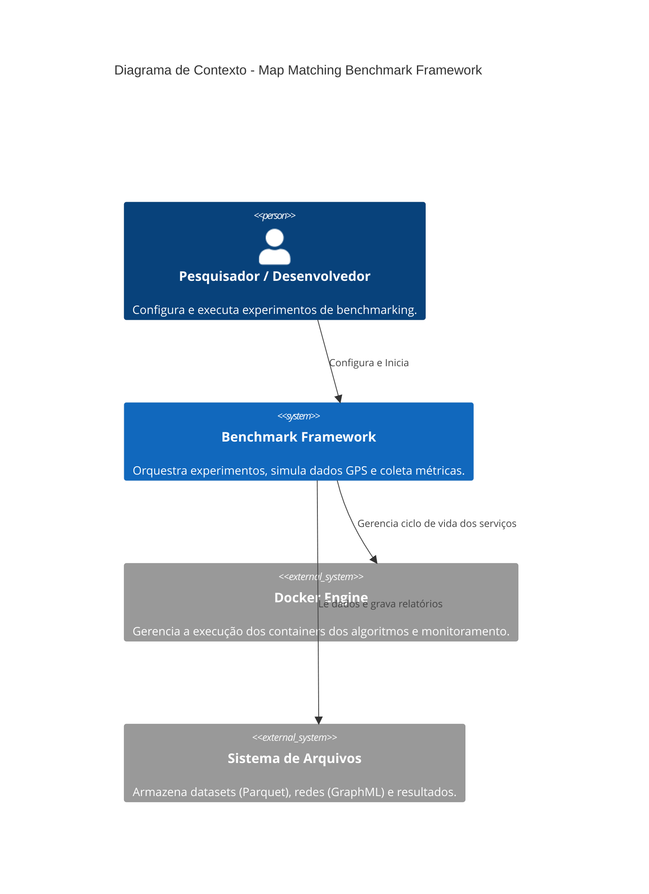
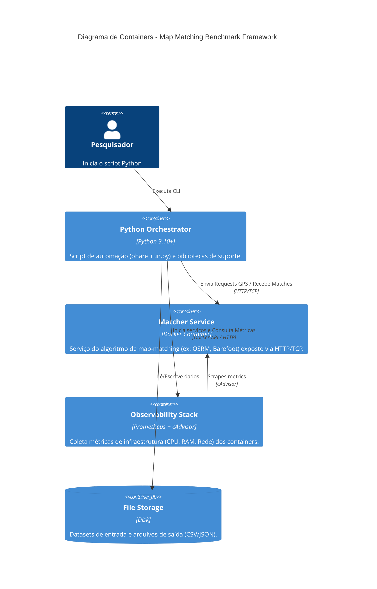
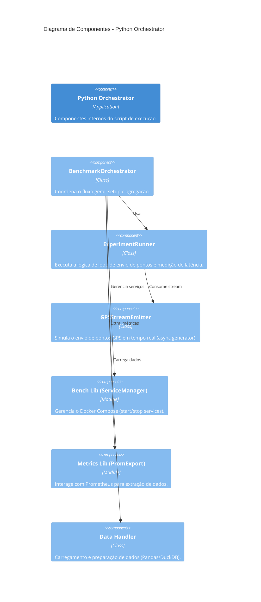

# Arquitetura do Framework de Benchmarking de Map Matching

Este documento descreve a arquitetura do sistema de execução de benchmarks para algoritmos de map matching, conforme implementado nos módulos `bench` e no orquestrador `ohare_run.py`.

## Visão Geral

O sistema é um framework de avaliação automatizado projetado para testar diferentes soluções de map matching (como OSRM, GraphHopper, Barefoot, Graphium) sob condições controladas. Ele orquestra a execução de experimentos, gerencia o ciclo de vida de serviços via Docker, simula fluxos de dados GPS em tempo real e coleta métricas detalhadas de desempenho (latência, vazão) e consumo de recursos (CPU, memória, rede).

## Componentes Principais

### 1. Orquestrador (`BenchmarkOrchestrator`)
Localizado em `ohare_run.py`, é o componente central que coordena todo o processo.
- **Responsabilidades:**
  - Carregar configurações (`BenchmarkConfig`) e dados de teste (trajetórias e malha viária).
  - Iterar sobre as combinações de veículos, taxas de amostragem e algoritmos (matchers).
  - Gerenciar o fluxo de execução global (setup -> execução -> teardown -> relatórios).
  - Agregar resultados de múltiplos experimentos.

### 2. Executor de Experimentos (`ExperimentRunner`)
Responsável pela execução lógica de um único teste de map matching.
- **Responsabilidades:**
  - Simular o envio de pontos GPS em "tempo real" usando o `GPSStreamEmitter`, que respeita o `time_speed_factor`.
  - Interagir com a interface do *matcher* (que deve implementar `BaseOnlineMatcher`).
  - Coletar métricas de latência "fim-a-fim" (E2E) para cada ponto ou lote processado.

### 3. Gerenciador de Serviços (`bench` package)
Módulo responsável pela infraestrutura de execução baseada em containers.
- **`bench/start_services.py` (`launch_service`):** Um gerenciador de contexto que usa `docker compose` para iniciar containers específicos para cada *matcher* antes de um experimento e desligá-los logo após. Injeta configurações dinâmicas (como `DATASET_ID`, `EXPERIMENT_ID`) via variáveis de ambiente.
- **`bench/compose.py`:** Wrapper Python para comandos CLI do Docker Compose.

### 4. Sistema de Métricas e Observabilidade (`bench` package)
Coleta dados de desempenho do sistema durante a execução dos containers.
- **`bench/start_metrics.py` (`track_metrics`):** Inicia a pilha de monitoramento (Prometheus + cAdvisor) como serviços Docker.
- **`bench/prom_export.py`:** Consulta a API do Prometheus após cada experimento para extrair séries temporais de uso de CPU, memória e rede, associando-as ao ID do experimento.

### 5. Camada de Dados (`DataLoader` & `OutputManager`)
- **Entrada:** Lê arquivos Parquet (trajetórias ruidosas e ground truth) e GraphML (rede viária).
- **Saída:** Persiste métricas brutas e agregadas em CSV e JSON, organizadas por execução.

---

## Diagramas de Arquitetura

### Fluxo de Execução (Sequence Diagram)

O diagrama abaixo ilustra o ciclo de vida de um benchmark completo para um conjunto de veículos.

### Arquitetura de Componentes (Class Diagram)

Este diagrama mostra a relação entre as classes Python e os módulos do sistema.

### Fluxo de Dados de Métricas

Como as métricas são coletadas de diferentes fontes e unificadas.

---

## Modelagem C4

Abaixo apresentamos a arquitetura do sistema utilizando o modelo C4 (Context, Containers, Components).

### Nível 1: Diagrama de Contexto (Context Diagram)

O diagrama de contexto situa o Sistema de Benchmarking em relação aos usuários e sistemas externos.

### Nível 2: Diagrama de Containers (Container Diagram)

Este nível detalha as aplicações e serviços executáveis que compõem o sistema.

### Nível 3: Diagrama de Componentes (Component Diagram)

Focando no container "Python Orchestrator", detalhamos seus componentes internos.

