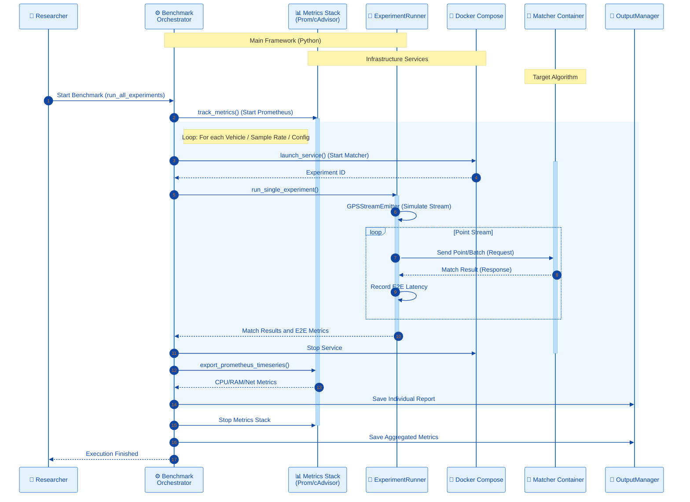
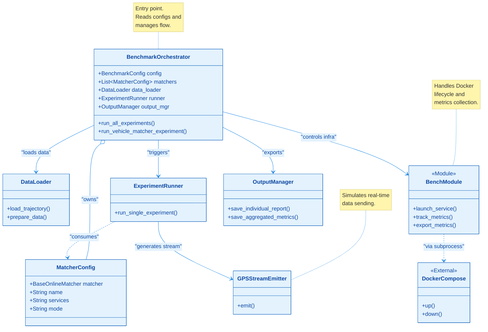
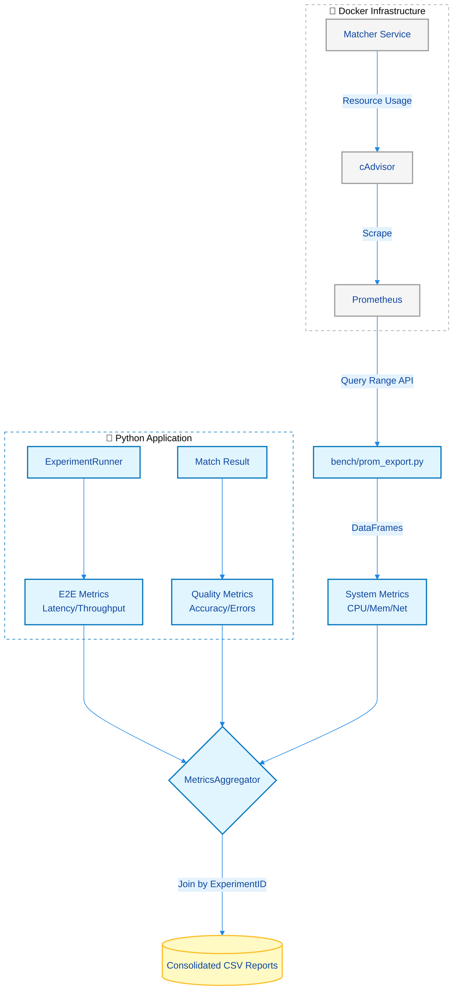
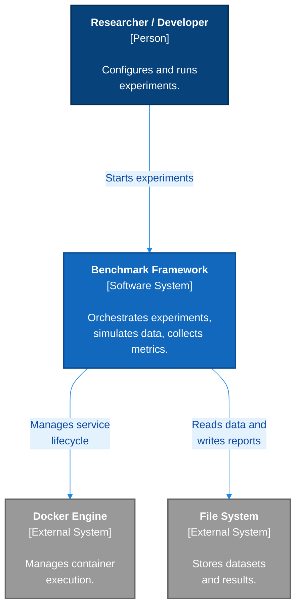
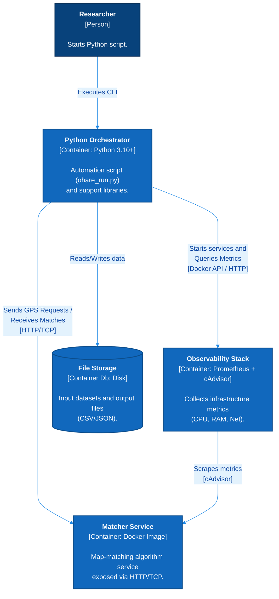
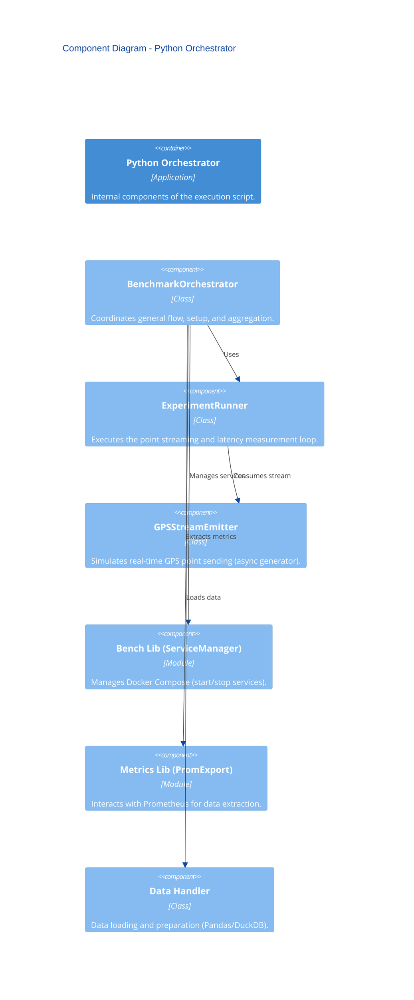
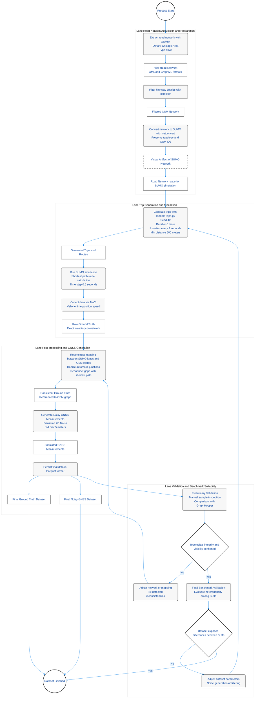

# Map Matching Benchmarking Framework Architecture

This document describes the architecture of the map matching benchmark execution system, as implemented in the `bench` modules and the `ohare_run.py` orchestrator.

## Overview

The system is an automated evaluation framework designed to test different map matching solutions (such as OSRM, GraphHopper, Barefoot, Graphium) under controlled conditions. It orchestrates experiment execution, manages service lifecycles via Docker, simulates real-time GPS data streams, and collects detailed performance metrics (latency, throughput) and resource consumption (CPU, memory, network).

## Core Components

### 1. Orchestrator (`BenchmarkOrchestrator`)

Located in `ohare_run.py`, this is the central component coordinating the entire process.

- **Responsibilities:**
  - Load configurations (`BenchmarkConfig`) and test data (trajectories and road network).
  - Iterate over vehicle, sampling rate, and algorithm (matcher) combinations.
  - Manage global execution flow (setup -> execution -> teardown -> reports).
  - Aggregate results from multiple experiments.

### 2. Experiment Executor (`ExperimentRunner`)

Responsible for the logical execution of a single map matching test.

- **Responsibilities:**
  - Simulate sending GPS points in "real-time" using `GPSStreamEmitter`, respecting the `time_speed_factor`.
  - Interact with the *matcher* interface (which must implement `BaseOnlineMatcher`).
  - Collect end-to-end (E2E) latency metrics for each processed point or batch.

### 3. Service Manager (`bench` package)

Module responsible for container-based execution infrastructure.

- **`bench/start_services.py` (`launch_service`):** A context manager that uses `docker compose` to start matcher-specific containers before an experiment and shut them down immediately after. Injects dynamic configurations (like `DATASET_ID`, `EXPERIMENT_ID`) via environment variables.
- **`bench/compose.py`:** Python wrapper for Docker Compose CLI commands.

### 4. Metrics and Observability System (`bench` package)

Collects system performance data during container execution.

- **`bench/start_metrics.py` (`track_metrics`):** Starts the monitoring stack (Prometheus + cAdvisor) as Docker services.
- **`bench/prom_export.py`:** Queries the Prometheus API after each experiment to extract CPU, memory, and network time series, associating them with the experiment ID.

### 5. Data Layer (`DataLoader` & `OutputManager`)

- **Input:** Reads Parquet files (noisy trajectories and ground truth) and GraphML (road network).
- **Output:** Persists raw and aggregated metrics in CSV and JSON, organized by run.

---

## Architecture Diagrams

### Execution Flow (Sequence Diagram)

The diagram below illustrates the lifecycle of a complete benchmark for a set of vehicles.

### Component Architecture (Class Diagram)

This diagram shows the relationship between Python classes and system modules.

### Metrics Data Flow

How metrics are collected from different sources and unified.

---

## C4 Modeling

Below is the system architecture using the C4 model (Context, Containers, Components).

### Level 1: Context Diagram

The context diagram situates the Benchmarking System relative to users and external systems.

### Level 2: Container Diagram

This level details the executable applications and services comprising the system.

### Level 3: Component Diagram

Focusing on the "Python Orchestrator" container, we detail its internal components.

